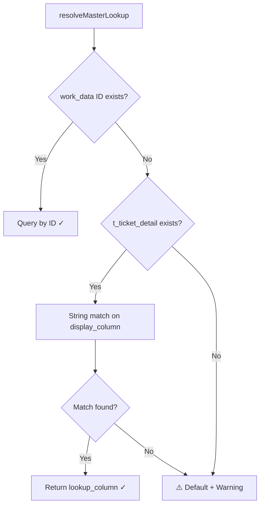

# Dynamic Master Lookup - Design Proposal

## Goal

Create a **reusable, UI-configurable mechanism** for resolving lookup values from master data. Not hardcoded for SRF - applicable to any service with any field.

---

## JSON Schema Changes (Form Builder)

### Current Field JSON

```json
{
  "field_id": "Category_field",
  "field_name": "Sample Category",
  "field_type": "select",
  "options": {
    "source": "api",
    "api_url": "/hots_settings/sample_categories"
  }
}
```

### Proposed Field JSON with `master_config`

```json
{
  "field_id": "Category_field",
  "field_name": "Sample Category",
  "field_type": "select_master",
  "options": {
    "source": "api",
    "api_url": "/hots_settings/sample_categories"
  },
  "master_config": {
    "table": "hots.m_sample_category",
    "display_column": "samplecat_name",
    "value_column": "samplecat_id",
    "lookup_column": "samplecat_shortname",
    "default_lookup": "GEN"
  }
}
```

| New Property | Purpose |
|--------------|---------|
| `field_type: "select_master"` | Signals that this field saves both display value AND ID |
| `master_config.display_column` | What user sees → stored in `t_ticket_detail` |
| `master_config.value_column` | ID → stored in `t_ticket_work_data` as `{field_id}_id` |
| `master_config.lookup_column` | Value resolved for document generation |
| `master_config.default_lookup` | Fallback if ID not found |

---

## Backward Compatibility (Existing Tickets)

Existing tickets only have `t_ticket_detail` (no `t_ticket_work_data`). We need a fallback chain:



### Generic Lookup Function with Fallback

```javascript
const resolveMasterLookup = async (ticketId, fieldConfig) => {
    const { table, display_column, value_column, lookup_column, default_lookup } = fieldConfig.master_config;
    const workDataKey = `${fieldConfig.field_id}_id`;
    
    // 1. Try work_data ID first (new tickets)
    const [workData] = await dbHots.promise().query(`
        SELECT field_value FROM t_ticket_work_data 
        WHERE ticket_id = ? AND field_name = ?
    `, [ticketId, workDataKey]);
    
    if (workData[0]?.field_value) {
        const [result] = await dbQuery(`
            SELECT ${lookup_column} FROM ${table} WHERE ${value_column} = ?
        `, [workData[0].field_value]);
        if (result[0]) return { value: result[0][lookup_column], source: 'work_data' };
    }
    
    // 2. Fallback to t_ticket_detail string match (existing tickets)
    const [detail] = await dbHots.promise().query(`
        SELECT cstm_col, value FROM t_ticket_detail 
        WHERE ticket_id = ? AND (lbl_col = ? OR cstm_col = ?)
    `, [ticketId, fieldConfig.field_id, fieldConfig.field_id]);
    
    const displayValue = detail[0]?.value || detail[0]?.cstm_col;
    if (displayValue) {
        const [result] = await dbQuery(`
            SELECT ${lookup_column} FROM ${table} WHERE ${display_column} = ?
        `, [displayValue]);
        if (result[0]) return { value: result[0][lookup_column], source: 'string_match' };
    }
    
    // 3. Default with warning
    console.warn(`⚠️ No match for ${fieldConfig.field_id}, using default: ${default_lookup}`);
    return { value: default_lookup, source: 'default', warning: true };
};
```

---

## Storage Strategy

| Table | What | When Saved | Purpose |
|-------|------|------------|---------|
| `t_ticket_detail` | Human-readable name | Ticket submission | Display to user, approvers |
| `t_ticket_work_data` | `{field_id}_id` = samplecat_id | Ticket submission (new) | Machine lookup, hidden from UI |

**New tickets:** Both tables populated
**Existing tickets:** Only `t_ticket_detail` → fallback to string matching

---

## Frontend Changes Required

### 1. Form Submission Handler

When field has `master_config`, save both values:

```javascript
// In ticket submission
if (field.master_config) {
    // Save display value to t_ticket_detail (existing behavior)
    await saveToTicketDetail(ticketId, field.field_id, selectedOption.label);
    
    // Save ID to t_ticket_work_data (new)
    await saveToWorkData(ticketId, `${field.field_id}_id`, selectedOption.value);
}
```

### 2. Assignment View

Hide work_data fields ending with `_id`:

```javascript
const visibleWorkData = workDataFields.filter(f => !f.field_name.endsWith('_id'));
```

---

## Implementation Status

| Step | Description | Status |
|------|-------------|--------|
| 1 | Add `samplecat_id` to system variable resolver | ✅ Done |
| 2 | Extend `formFieldMapping.ts` to auto-generate `_id` fields | ✅ Done |
| 3 | Backend already saves all fields (including `_id`) to `t_ticket_detail` | ✅ Already works |
| 4 | Update SRF document generator to use `Category_field_id` | 🔲 Pending |
| 5 | Hide `_id` fields in assignment UI | 🔲 Pending |

## Files Changed

- [systemVariableDefinitions.ts](file:///d:/GIT-Based-Backend/Integrated-API.worktrees/AntiGravityWorktree/fontend/HOTS/src/utils/systemVariableDefinitions/systemVariableDefinitions.ts) - Added `samplecat_id` and `samplecat_shortname`
- [formFieldMapping.ts](file:///d:/GIT-Based-Backend/Integrated-API.worktrees/AntiGravityWorktree/fontend/HOTS/src/utils/formFieldMapping.ts) - Extended auto-generation of `_id` fields for category
