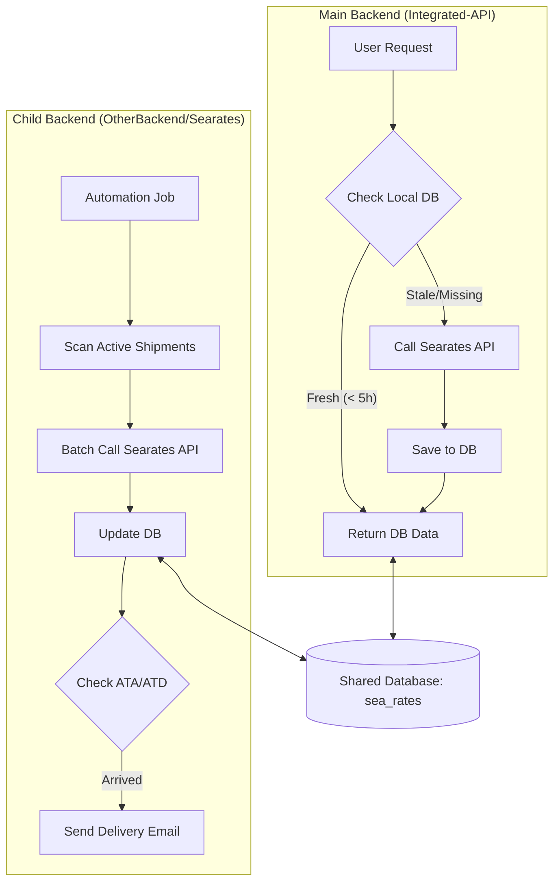

# Searates Backend Architecture & Correlation

This document explains the relationship between the main **Integrated-API** backend and the **Searates Child Backend** located in `OtherBackend/Searates`.

## 🏗️ Architectural Model: Hybrid Proactive-Reactive
The system employs a dual-layered approach to tracking shipments via the Searates API. Both components share the same database schema (`sea_rates`) and API infrastructure but serve different operational roles.

### 1. Child Backend (`OtherBackend/Searates`)
**Role:** Automated Background Sync & Notification Engine
- **Mode:** Proactive.
- **Functionality:** 
  - Automatically fetches tracking data for active shipments (filtered by upcoming ETA/ETD or unfinished status).
  - Performs batch updates to the `sea_rates` database schema.
  - Handles business logic for **Notifications**: It sends "E-Order Delivered" or "i2i Delivered" emails once actual arrival (ATA) or departure (ATD) is detected.
- **Trigger:** Currently configured to run `Searates.runCheck()` upon server initialization.

### 2. Main Backend (`Integrated-API`)
**Role:** Data Provider & On-Demand Synchronizer
- **Mode:** Reactive.
- **Functionality:**
  - **Data Service:** Serves the tracking data to frontend widgets (e.g., Online Order tracking page).
  - **On-Demand Fetch:** If a user requests tracking data that is missing or older than 5 hours, the `srtsController` triggers an immediate API call to Searates to ensure the user sees the most current information.
  - **Persistence:** Updates the shared `sea_rates` schema with any new data fetched on-demand.

---

## 🔄 Data Flow & Correlation

## 📋 Integration Summary

| Feature | Child Backend | Main Backend |
| :--- | :--- | :--- |
| **Primary Goal** | Background Sync & Alerts | User Data Serving & Freshness |
| **Trigger** | Startup / Automation | User Interaction |
| **Database** | Shared (`sea_rates` / `iod`) | Shared (`sea_rates` / `iod`) |
| **API Load** | Reduced (Batch) | Dynamic (On-Demand) |
| **Email Services** | Included | Not primarily responsible |

## 💡 Benefits of this Design
- **Redundancy:** If the background worker fails, the main backend still ensures users get data.
- **Performance:** Most user requests are served directly from the database because the child backend has pre-fetched the data.
- **Separation of Concerns:** The main backend stays "lean" by offloading heavy background scanning and email notification logic to the child process.

> [!NOTE]
> Both systems rely on a valid `SEARATES_API_KEY` (stored in `.env` for each backend) and shared database credentials.
